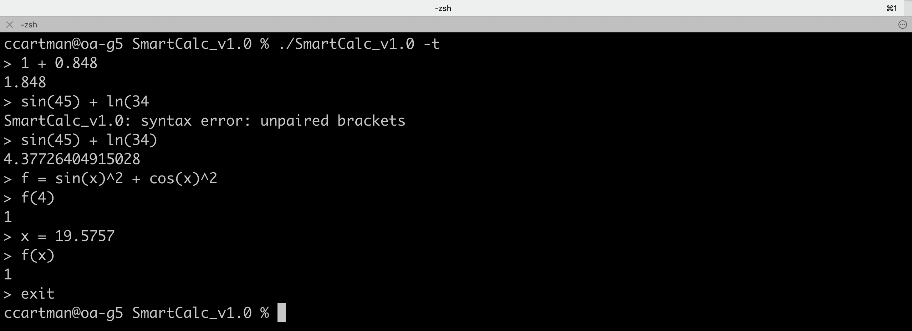

# SmartCalc_v1.0
Implementation of calculator.

## Subject
- [Subject EN](./docs/subject_en.md)
- [Subject RU](./docs/subject_ru.md)

## Usage
- The program is written in C using the GTK4 framework.
- `$>make` for compilation:
- The program works in two modes:
  - `$>./Smartcalc -t` for the command line interface mode
  - Supports arithmetic operations: unary plus(`+`) and minus(`-`), binary addition(`+`), subtraction(`-`), multiplication(`*`), division(`/`), modulus(`mod`) and exponentiation(`^`).
  - Supports functions: sine(`sin`), cosine(`cos`), tangent(`tan`), arcsine(`asin`), arccosine(`acos`), arctangent(`atan`), square root(`sqrt`), natural logarithm(`ln`) and decimal logarithm(`log`)
  - Supports any number of operator brackets
  
