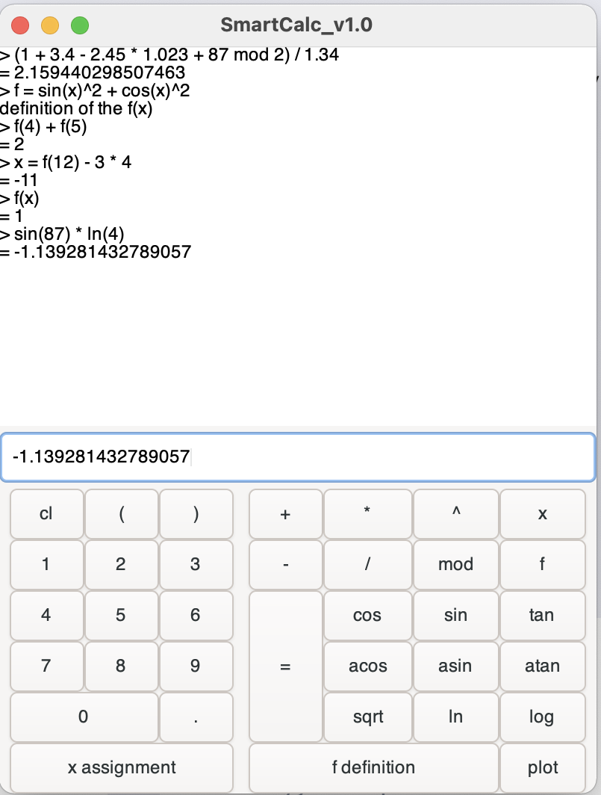
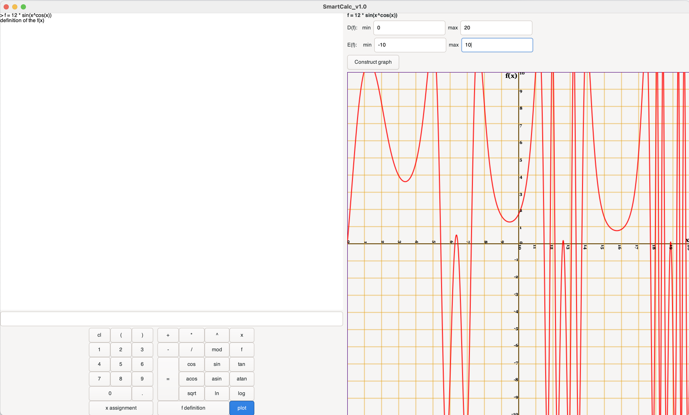

# SmartCalc_v1.0
Implementation of calculator.

## Subject
- [Subject EN](./docs/subject_en.md)
- [Subject RU](./docs/subject_ru.md)

## Usage
- The program is written in C using the GTK4 framework.
- Supports arithmetic operations: unary plus(`+`) and minus(`-`), binary addition(`+`), subtraction(`-`), multiplication(`*`), division(`/`), modulus(`mod`) and exponentiation(`^`).
- Supports functions: sine(`sin`), cosine(`cos`), tangent(`tan`), arcsine(`asin`), arccosine(`acos`), arctangent(`atan`), square root(`sqrt`), natural logarithm(`ln`) and decimal logarithm(`log`)
- Supports any number of operator brackets
- Supports the assignment operation to a variable (`x = expr`). It is possible to set only one variable named x
- Supports the definition a function from a single variable (`f = expr`)
- `$>make` for compilation:
- The program works in two modes:
  - `$>./Smartcalc -t` for the command line interface mode \
    
  - `$>./Smartcalc` for the graphic user interface \
    
  - In graphical mode, the display of graphs of functions is supported
    
- `$>make dist` command creates an archive for further distribution
- `$>make install` and `$>make uninstall` to install and uninstall the program (default installation path is `~/bin`)
